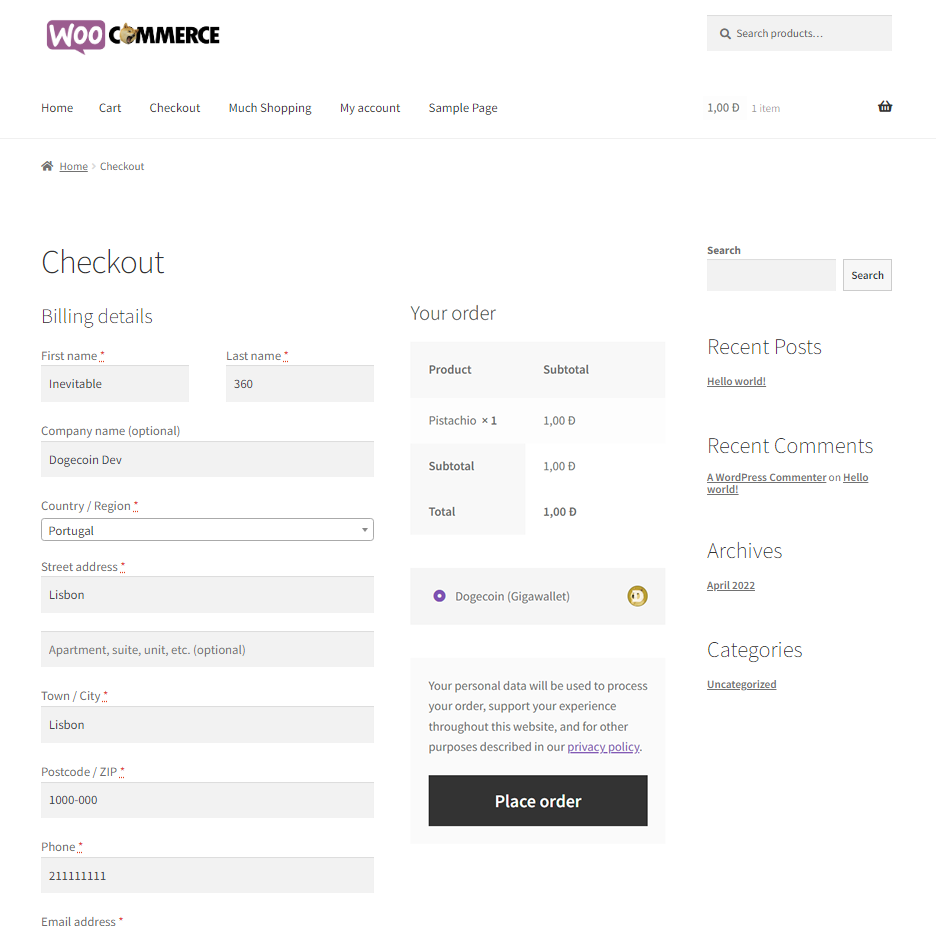

<h1 align="center">
GigaWallet Dogecoin Payment Gateway for Wordpress and Woocommerce
<br><br>

<br><br>
</h1>
<h2>
Accept Dogecoin Payments using Gigawallet backend service without the need of any third party payment processor, banks, extra fees. Your Store, your wallet, your Doge.
</h2>
<br><br>
## How to Install 💻

1- Download and extract the Gateway

2- Upload all files to your Wordpress/Woocommerece online store on the folder ```wp-content\plugins\```

3- Now navigate into your Wordpress Backoffice and go to ```Plugins```->```Installed``` and click on ```Activate```

4- Navigate to ```Woocommerce```->```Settings```->```Payments``` and Activate the ```GigaWallet Dogecoin Gateway``` and click on ```Manage``` to set up your Gigawallet Server, Dogecoin Payout Address and instructions

enjoy your sells in Dogecoin with auto convert Fiat prices into Doge :P

**Note: You must have installed and running:
- your own GigaWallet service: https://gigawallet.dogecoin.org/
- latest version of Wordpress CMS and Woocommerce plugin: https://wordpress.org/
